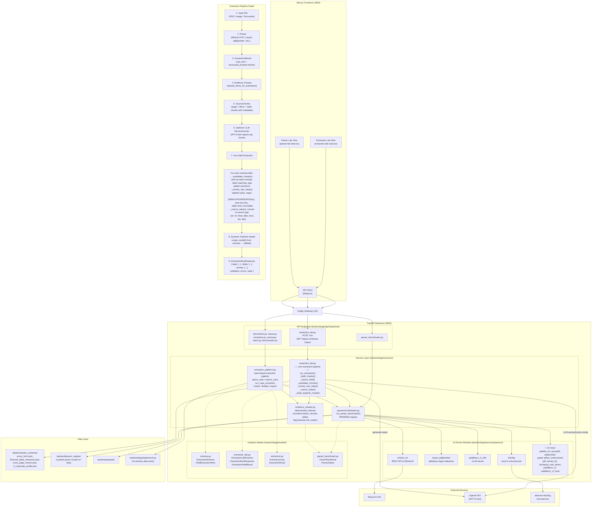

# ExtractIQ — Architectural Workflow

## Input → Output Alignment

| Level                | Mechanism                                                                                                | Location                        |
| -------------------- | -------------------------------------------------------------------------------------------------------- | ------------------------------- |
| **Structure**  | Schema field keys become output dict keys (1:1 mapping).`data[field.key] = result.value`               | `extraction_lab.py:182`       |
| **Types**      | `_coerce_value()` converts raw strings to the field's declared type                                    | `extraction_lab.py:944-971`   |
| **Validation** | Dynamic Pydantic model is built from the same schema fields;`model_validate()` rejects type mismatches | `extraction_lab.py:1036-1057` |
